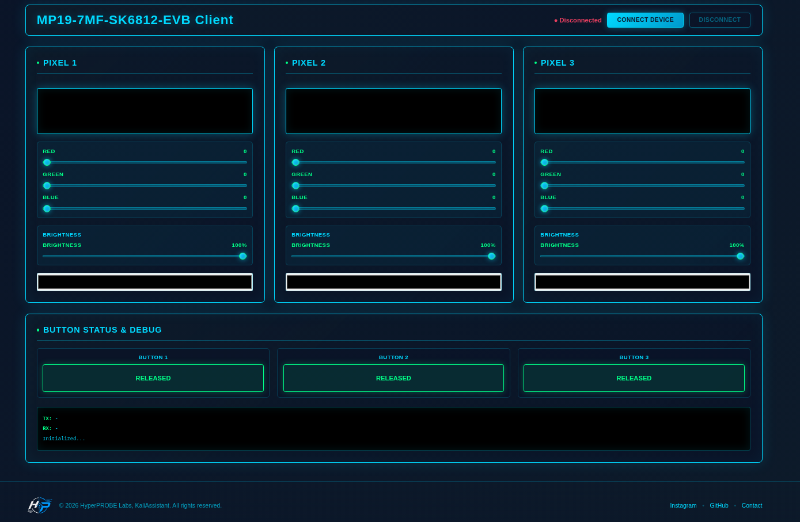

# MP19-7MF-SK6812-WEBCLI

Web-based client for MP19-7MF-SK6812-EVB development board.

This project provides a simple WebSerial-based control interface for the EVB. It can be served either through a lightweight HTTP server or installed via a prebuilt Windows installer.



## Quick Start

You can run this project in three ways:

## Option 1 — Github Pages (Recommended)
Open your browser, then go to [hyperprobelabs.github.io/MP19-7MF-SK6812-WEBCLI](https://hyperprobelabs.github.io/MP19-7MF-SK6812-WEBCLI/)

> Make sure you are using a WebSerial-compatible browser (Chrome / Edge).

## Option 2 — Simple HTTP Server (local)

Serve the web UI directly from the `./web` directory:

```sh
cd web
python3 -m http.server 18080
```
Then open:

`http://localhost:18080`

> Make sure you are using a WebSerial-compatible browser (Chrome / Edge).

## Option 3 — Prebuilt Installer (Windows x86_64)

If you cannot host the web files manually, use the installer from the Releases page.

- Platform: Windows x86_64
- Installer: Inno Setup
- Features: WebSerial-enabled client runtime

###  Notes

- This software relies on WebSerial API, which requires a compatible browser (Chrome / Edge).
- A local server is required for browser access due to WebSerial security restrictions.
- If you prefer full control, you can build everything from source (see below).

##  Build From Source

### Requirements

- Linux environment or Docker
- docker.io installed

### Build Steps

```sh
./build.sh # Windows: ./build.bat or ./build.ps1
```

### Output
After successful build:

`Output/MP19-7MF-SK6812-EVB_Setup.exe`

## Packaging

The Windows installer is generated using Inno Setup inside a Docker-based build environment.

## Security / Trust

If you do not trust the prebuilt binary:

- Build from source using the steps above
- Or inspect the build scripts

No code signing certificate is used in the release builds.

## License

MIT License © 2026 HyperPROBE Labs, KaliAssistant
